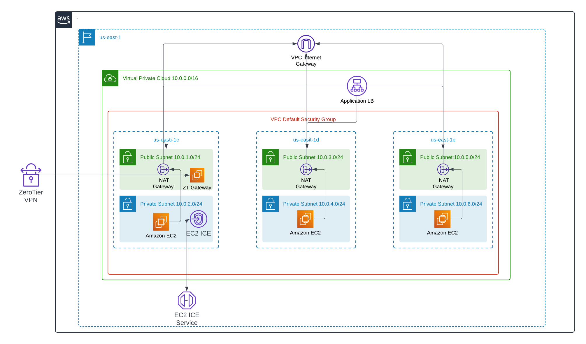

Proof of concept. VPC with 3 public and 3 private subnets in 3 availability zones.  Public uses internet gateway for exit, private uses NAT gatewateways.
Three EC2 instances are used in the private networks running nginx with a Application Load balancer.

Access is granted via EC2 Instant Connect Endpoint, or ZeroTier VPN network access.

* Look in terraform.tfvars for any updates
* Run Terraform(init/validate/apply)
* Update Ansible Inventory
* Run zerotier.yml (Update nedwork ID in play)
* Accept ZT Gateway client in My ZeroTier Network configuration. 
* Update Route for VPC 10.0.0.0/16 to ZT Gateway Client IP
* Run ngix.yml

# Notes
* EC2 ICE Service only works if host SSH is opened in the security group to public IP address of client. (See terraform.tfvars)

# Accessing EC2 resources either through Instant Connect or ZeroTier VPN

# EC2 Instance Connect

* ssh -i ~USERNAME/Downloads/Key1.pem ubuntu@i-INSTANCE -o ProxyCommand='aws ec2-instance-connect open-tunnel --instance-id i-INSTANCE'

# Zerotier
Provided the client is installed and also joined the network. You can reach any of the VPC subnets IP's

* ssh -i ~USERNAME/Downloads/Key1.pem ubuntu@IP_ADDRESS 

